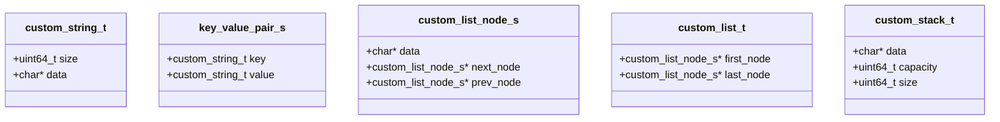
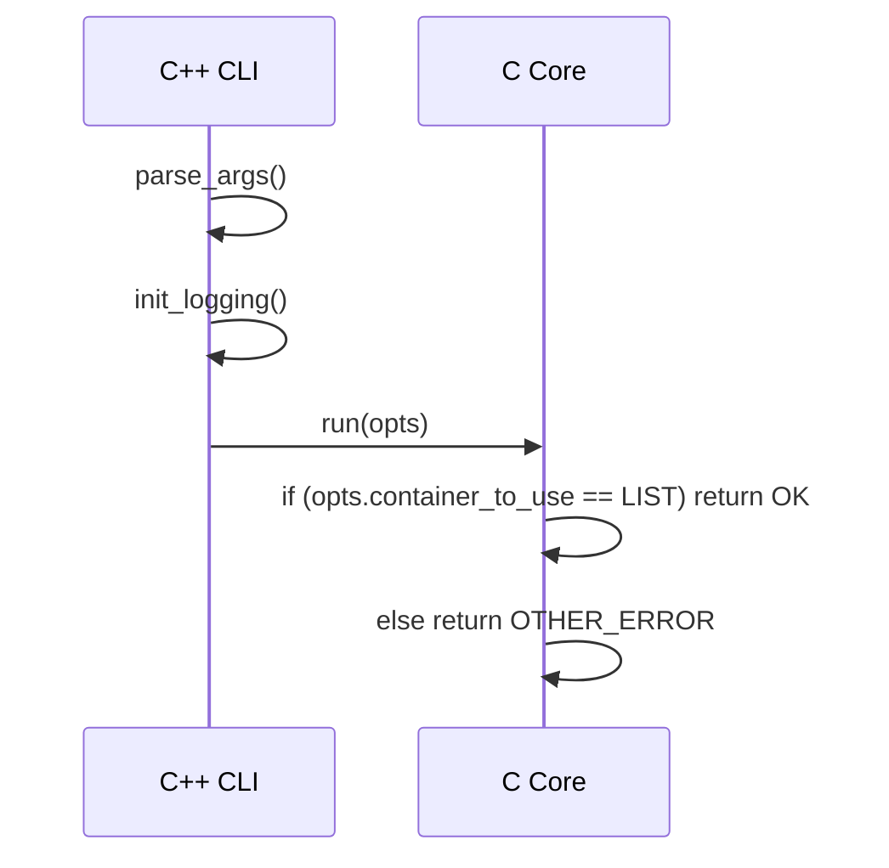

# Homework 6 – Password Manager

## Overview

This project implements a simple command‑line password manager.  The
application can store key‑value pairs (a *key* and a *value* that
represents a password) in one of two in‑memory containers:

* **List** – a doubly linked list.
* **Stack** – a dynamic array (vector‑like) that grows when needed.

The program is split into C and C++ parts:

* **C** – contains the data‑structures and low‑level helpers.
* **C++** – contains the command line parser, logging and the
  entry point.

The current repository contains only the *skeleton* of the solution –
many functions are stubs or partially implemented.  The README below
describes the intended design and how the pieces fit together.

---

## Directory layout

```
hw6/
├─ src/
│  ├─ list.c          – implementation of the doubly linked list.
│  ├─ stack.c         – implementation of the dynamic array stack.
│  ├─ string_utils.c  – helpers for serialising/deserialising
│  │                    custom_string_t.
│  ├─ serialize.c     – helpers for adding/removing items to/from
│  │                    stack/list.
│  ├─ main_module.c   – high‑level logic that decides which
│  │                    container to use.
│  └─ main.cpp        – command‑line interface, logging and
│                        program entry point.
├─ include/
│  ├─ main.h          – public API, enums and data structures.
│  ├─ list.h
│  ├─ stack.h
│  ├─ string_utils.h
│  └─ serialize.h
└─ README.md          – this file.
```

---

## Data structures

### `custom_string_t`

```c
typedef struct {
    uint64_t size;   // number of bytes in the string
    char*    data;   // pointer to the raw data
} custom_string_t;
```

It is a simple, self‑contained string that can be serialised to a
buffer.

### `key_value_pair_s`

```c
typedef struct {
    custom_string_t key;
    custom_string_t value;
} key_value_pair_s;
```

Represents a single password entry.

### `custom_list_t`

```c
typedef struct custom_list_node_s {
    char*                     data;        // raw bytes of a key_value_pair_s
    struct custom_list_node_s* next_node;
    struct custom_list_node_s* prev_node;
} custom_list_node_t;

typedef struct {
    custom_list_node_t* first_node;
    custom_list_node_t* last_node;
} custom_list_t;
```

A classic doubly linked list.  The list stores *raw* bytes of
`key_value_pair_s` – this keeps the implementation generic.

### `custom_stack_t`

```c
typedef struct {
    char*    data;      // contiguous buffer
    uint64_t capacity;  // allocated size
    uint64_t size;      // used bytes
} custom_stack_t;
```

A dynamic array that grows by doubling its capacity when needed.

---

## Mermaid diagrams





---

## Public API (see `include/main.h`)

| Symbol | Purpose |
|--------|---------|
| `operation_t_e` | Enumeration of supported operations (add, delete, list, find). |
| `container_to_use_t_e` | Which container to use – `LIST` or `STACK`. |
| `pass_manager_options_t` | Options passed to `run()`. |
| `key_value_pair_s` | A key/value pair. |
| `run()` | Entry point for the password manager logic. |

---

## Core logic (C files)

### List (`list.c`)

* `create_list()` – returns an empty list.
* `push_back_list()` – appends a new node to the tail.
* `pop_back_list()` – removes the tail node.
* `find()` – linear search using a user‑supplied comparator.
* `delete_node()` – removes a node from the list and frees its data.
* `free_list()` – frees the whole list, calling a user‑supplied
  `data_free` callback for each node.

### Stack (`stack.c`)

* `create_stack()` – creates a stack with zero capacity.
* `create_stack_with_capacity()` – creates a stack with a given
  initial capacity.
* `push_stack()` – appends data to the end, resizing if needed.
* `pop_stack()` – removes data from the end.
* `free_stack()` – frees the underlying buffer.

### String utilities (`string_utils.c`)

* `string_read_from_buffer()` – reads a `custom_string_t` from a raw
  buffer.
* `string_write_to_buffer()` – writes a `custom_string_t` into a
  raw buffer.
* `string_free()` – frees the data inside a `custom_string_t`.

### Serialization helpers (`serialize.c`)

* `add_pair_to_stack()` / `add_pair_to_list()` – push a
  `key_value_pair_s` into the chosen container.
* `is_empty_stack()` / `is_empty_list()` – check if a container is
  empty.
* The file also declares the public functions that will be used by
  the higher‑level logic (`add_password_to_stack`, `delete_password_from_stack`, etc.).
  These functions are currently only declared – the implementation
  is missing.

---

## High‑level flow

1. **CLI** (`main.cpp`) parses arguments using Boost.ProgramOptions.
2. It builds a `pass_manager_options_t` structure and calls `run()`.
3. `run()` (in `main_module.c`) currently only checks the container
   type:
   * If `LIST` – returns `OK`.
   * Otherwise – returns `OTHER_ERROR`.
4. The rest of the logic (reading/writing from the file, performing
   add/delete/list/find operations) is not implemented yet.

The intended design is that `run()` would:

```c
switch (opts.command) {
    case ADD_PASSWORD:
        add_password_to_stack(...);
        break;
    case REMOVE_PASSWORD:
        delete_password_from_stack(...);
        break;
    case LIST_PASSWORDS:
        list_passwords_from_stack(...);
        break;
    case FIND_BY_KEY:
        find_password_by_key_from_stack(...);
        break;
}
```

Each of those helper functions would use the serialization helpers
to read the file into the chosen container, perform the operation, and
write the container back to disk.

---

## How to build

The project uses CMake (the `CMakeLists.txt` is provided in the root
directory).  Run the following commands:

```bash
mkdir build && cd build
cmake ..
make
```

The executable will be `./hw6`.

---

## Running the program

```bash
./hw6 <options> <command> [<key>] [<value>]
```

**Options**:

| Flag | Description |
|------|-------------|
| `-h, --help` | Show help message |
| `-q, --quiet` | Disable logging |
| `-c, --container <list|stack>` | Choose container (default: `stack`) |
| `-f, --file_path <path>` | Path to the password file (default: `.passwords`) |

**Commands**:

| Command | Arguments | Description |
|---------|-----------|-------------|
| `add` | `<key> <value>` | Add a new password |
| `delete` | `<key>` | Remove a password |
| `list` | – | List all passwords |
| `find` | `<key>` | Find a password by key |

Example:

```bash
./hw6 add mysite "SuperSecret123"
```

---

## Future work

The current repository is a *framework* for the assignment.  The
following tasks remain:

1. **Implement the missing functions** – especially those in
   `serialize.c` and `main_module.c`.
2. **File I/O** – read/write the container from/to the file using
   the serialization helpers.
3. **Error handling** – provide meaningful return codes and log
   messages.
4. **Unit tests** – add tests under `hw6/tests` to validate
   functionality.

---

## License

This project is provided for educational purposes and is licensed
under the MIT License.
